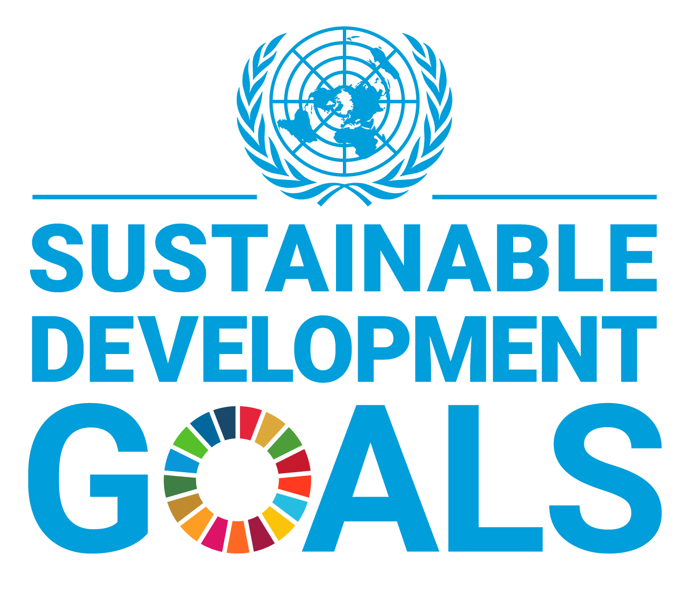
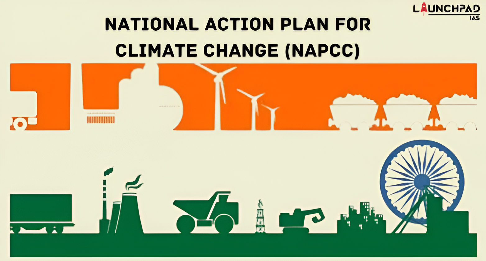

```{r setup, include=FALSE}
# ══════════════════════════════════════════════════════
# 不需要修改这个 chunk，直接保留
# ══════════════════════════════════════════════════════
options(htmltools.dir.version = FALSE)
knitr::opts_chunk$set(
  echo = FALSE, message = FALSE, warning = FALSE,
  fig.retina = 3, fig.align = "center"
)
```

```{r libraries, include=FALSE}
# ══════════════════════════════════════════════════════
# 在这里加载你需要的包
# 如果你不做地图，可以删掉 sf / tmap / rnaturalearth
# ══════════════════════════════════════════════════════
library(ggplot2)
library(scales)
library(showtext)

# 如需地图：
# library(sf)
# library(tmap)
# library(rnaturalearth)
# library(rnaturalearthdata)

# 如需 Venn 图：
# library(ggforce)

# 如需流程图：
# library(DiagrammeR)

font_add_google("Cormorant Garamond", "cormorant")
font_add_google("Outfit", "outfit")
showtext_auto()

# ── 共享主题（所有图表都用这个，不要修改）──────────────
theme_eoheat <- function(base_size = 12) {
  theme_minimal(base_family = "outfit", base_size = base_size) +
  theme(
    plot.background  = element_rect(fill = "#0F1117", color = NA),
    panel.background = element_rect(fill = "#0F1117", color = NA),
    panel.grid.major = element_line(color = "#252A40", linewidth = 0.4),
    panel.grid.minor = element_blank(),
    text             = element_text(color = "#9DA3B4"),
    axis.text        = element_text(color = "#5C6380", size = rel(0.82)),
    axis.title       = element_text(color = "#9DA3B4", size = rel(0.9)),
    plot.title       = element_text(color = "#EDE8DF", face = "bold",
                                    size = rel(1.15), margin = margin(b = 6)),
    plot.subtitle    = element_text(color = "#9DA3B4", size = rel(0.85),
                                    margin = margin(b = 12)),
    plot.caption     = element_text(color = "#5C6380", size = rel(0.7),
                                    hjust = 0, margin = margin(t = 8)),
    legend.background = element_rect(fill = "#0F1117", color = NA),
    legend.text      = element_text(color = "#9DA3B4"),
    legend.title     = element_text(color = "#EDE8DF"),
    plot.margin      = margin(12, 12, 12, 12)
  )
}
```

---
<!--
████████████████████████████████████████████████████████
  SLIDE 模板说明
  
  每张 slide 以 --- 开头
  标题用 ## 
  slide 内布局选一种：
  
  ┌─────────────────────────────┐
  │ 布局A：左宽右窄 (60/36)     │
  │ .left-wide[ ]               │
  │ .right-narrow[ ]            │
  ├─────────────────────────────┤
  │ 布局B：左窄右宽 (36/60)     │
  │ .left-narrow[ ]             │
  │ .right-wide[ ]              │
  ├─────────────────────────────┤
  │ 布局C：左右各半 (50/50)     │
  │ .pull-left[ ]               │
  │ .pull-right[ ]              │
  ├─────────────────────────────┤
  │ 布局D：整页（不分栏）       │
  │ 直接写内容即可              │
  └─────────────────────────────┘

  每个 chunk 名字必须全局唯一！
  建议命名：fig-XX-你的缩写，如 fig-lst-ls
████████████████████████████████████████████████████████
-->

---

<!--
╔══════════════════════════════════════════════════════╗
║  SLIDE 02 · The Problem: Extreme Urban Heat Kills    ║
║  布局A：左栏上下叠两图，右栏统计数字                 ║
╚══════════════════════════════════════════════════════╝
-->

## The Problem: Extreme Urban Heat Kills

.slide-label[Slide 02 · Problem Definition]

.left-wide[

<div style="display:flex; gap:0.8rem; align-items:flex-start; margin-bottom:0.3rem;">

<div style="flex:1.5;">
```{r fig-lst-syz, out.width="100%", fig.align="left"}
knitr::include_graphics("fig_lst_ahmedabad.png")
```
</div>

<div style="flex:1;">
```{r fig-pie-hyj, out.width="100%", fig.align="center"}
knitr::include_graphics("Land Cover 2019.png")
```
</div>

</div>

```{r fig-a-syz, fig.height=2.8, fig.width=9.8, dev.args=list(bg="#0F1117")}
# ══════════════════════════════════════════════
# 📊 下图：人口与建成区折线图
# 数据来源：
#   Built-up area — Chaturvedi et al. (2022) Table 4
#   Population — Census of India (2001,2011); World Population Review
# ══════════════════════════════════════════════
df <- data.frame(
  year       = c(1990, 2000,  2001,  2010,  2011,  2019),
  population = c(3.547,4.519, 4.519, 5.578, 5.578, 7.868),
  builtup    = c(132.45,181.55,NA,  276.46, NA,   305.24)
)
df_builtup <- df[!is.na(df$builtup), ]
coeff <- 40

ggplot(df, aes(x = year)) +
  geom_area(data = df_builtup,
            aes(y = builtup / coeff), fill = "#C9A96E", alpha = 0.12) +
  geom_line(data = df_builtup,
            aes(y = builtup / coeff, color = "Built-up Area (km²)"),
            linewidth = 1.1, linetype = "dashed") +
  geom_point(data = df_builtup,
             aes(y = builtup / coeff, color = "Built-up Area (km²)"),
             size = 2.5, shape = 15) +
  geom_line(aes(y = population, color = "Population (millions)"),
            linewidth = 1.3) +
  geom_point(aes(y = population, color = "Population (millions)"),
             size = 2.8, shape = 19) +
  annotate("segment",
           x = 2010, xend = 2010, y = 0.3, yend = 9.4,
           color = "#E05C5C",alpha = 0.72,linewidth = 1) +
  annotate("label", x = 2010.4, y = 2.6,
           label = "May 2010\n1,344 deaths",
           fill = "#1E2235", color = "#E05C5C",
           size = 10.5, fontface = "bold", family = "outfit",
           label.padding = unit(0.2, "lines"),
           lineheight = 0.6, 
           label.r = unit(0.15, "lines"), hjust = 0) +
  scale_y_continuous(
    name = "Population (millions)", limits = c(0, 9.5),
    sec.axis = sec_axis(~ . * coeff, name = "Built-up Area (km²)")
  ) +
  scale_x_continuous(breaks = c(1990, 2000, 2010, 2019)) +
  scale_color_manual(values = c("Population (millions)" = "#EDE8DF",
                                "Built-up Area (km²)"   = "#C9A96E")) +
  labs(title   = "Rapid urbanisation drives escalating heat risk",
       caption = "Built-up: Chaturvedi et al. (2022) Table 4 · Population: Census of India / World Pop Review",
       x = NULL, color = NULL) +
  theme_eoheat(base_size = 10) +
  theme(legend.position    = c(0.18, 0.82),
      legend.text        = element_text(size = 26),
      legend.key.size    = unit(0.4, "cm"),
      axis.text          = element_text(size = 27, color = "#9DA3B4"),  # ← 轴刻度
      axis.title         = element_text(size = 27, color = "#9DA3B4"),  # ← 轴标题
      axis.title.y.right = element_text(size = 27, color = "#C9A96E"),
      axis.title.y.left  = element_text(size = 27, color = "#EDE8DF"),
      plot.title         = element_text(size = 29),
      plot.caption       = element_text(size = 26),
      plot.margin        = margin(4, 8, 4, 8))
```

<div style="text-align:left;">
.fig-caption[Top Left: LST map · Landsat 8 TIRS via GEE &nbsp;·&nbsp; Top Right: Land Cover 2019 · Chaturvedi et al. (2022)  
Bottom: Built-up & population · Chaturvedi et al. (2022)]
</div>

]

<div class="right-narrow" style="margin-top:-2.5rem;">

.stat-box.alert[
<span class="stat-number">1,344</span>
<span class="stat-label">Excess deaths, May 2010</span>
<span class="stat-source">Azhar et al. (2014), PLOS ONE</span>
]

.stat-box[
<span class="stat-number">46.8°C</span>
<span class="stat-label">Peak temperature, May 25</span>
<span class="stat-source">IMD / Azhar et al. (2014)</span>
]

.stat-box[
<span class="stat-number">+130%</span>
<span class="stat-label">Built-up area growth, 1990–2019</span>
<span class="stat-source">Chaturvedi et al. (2022) Table 4</span>
]

.stat-box.teal[
<span class="stat-number">70%</span>
<span class="stat-label">of city area projected ≥45°C</span>
<span class="stat-source">Mohammad et al. (2022)</span>
]

</div>


---

## Who Suffers Most? Heat Vulnerability is Unequal

.slide-label[Slide 03 · Problem Definition]

.pull-left[
<div style="margin-top:-1.4rem;">
```{r fig-c, out.width="100%", fig.align="left"}
knitr::include_graphics("IPCC.png")
```
</div>
.fig-caption[Fig. C · IPCC AR6 Risk Framework adapted for Ahmedabad]

]

.pull-right[

### Most exposed groups


| Group | Mechanism |
|-------|-----------|
| 🏚️ Slum communities | Metal roofs, no shade, no greenery |
| <span style="color:#EDE8DF">👷 Outdoor workers</span> | <span style="color:#9DA3B4">Direct thermal exposure, 8h+/day</span> |
| 👴 Elderly & infants | Impaired thermoregulation |
| <span style="color:#EDE8DF">💰 Low-income</span> | <span style="color:#9DA3B4">No AC, no access to cooling centres</span> |

<br>

> "The official temperature is recorded **8 km outside** the city. On the tarmac where workers walk, it can be **10°C hotter**."
>
> — Dr. Mavalankar, *Exemplars in Global Health* (2022)

.chip.alert[Spatial Data Gap] .chip[Ward-level] .chip.teal[1 Weather Station]

]

.footnote[IPCC AR6 WGII (2022) Ch.8 · Knowlton et al. (2014) *IJERPH* 11(4):3473 · Exemplars in Global Health (2022)]

---

## Policy Context: From Global Goals to Local Action

.slide-label[Slide 04 · Problem Definition]

.left-narrow[
<div style="height:1.5rem;"></div>

.policy-global[
<p style="font-family:var(--font-body); font-size:0.85em; font-weight:500; letter-spacing:0.18em; text-transform:uppercase; color:var(--teal); margin:0.6 0 0.6rem 0;">🌍 Global</p>
<div style="display:flex; justify-content:space-between; align-items:flex-start; gap:0.5rem;">
<div style="font-size:0.95em; line-height:1.8;font-family:var(--font-body);">
<strong>SDG</strong> 3.9 · 11.5 · 11.7 · 13.1<br>
<strong>Sendai Framework</strong> Priority 1 &amp; 3<br>
<strong>New Urban Agenda</strong> Para 37, 65, 79<br>&nbsp;
</div>

</div>
]

<span style="font-size:1.2em; color:#5C6380;"></span>

.policy-national[
<p style="font-family:var(--font-body); font-size:0.85em; font-weight:500; letter-spacing:0.18em; text-transform:uppercase; color:var(--gold); margin:0.6 0 0.6rem 0;">🕌 Regional</p>

<div style="display:flex; justify-content:space-between; align-items:flex-start; gap:0.5rem;">
<div style="font-size:0.98em; line-height:1.8;font-family:var(--font-body);">
<strong>NAPCC</strong> — Mission on Sustainable Habitat<br>
<strong>India NDC 2022</strong> — 33% urban green cover<br>&nbsp;
</div>

</div>
]

<span style="font-size:1.2em; color:#5C6380;"> </span>

.policy-local[
<p style="font-family:var(--font-body); font-size:0.85em; font-weight:500; letter-spacing:0.18em; text-transform:uppercase; color:var(--white); margin:0.6 0 0.6rem 0;">🌇 Local</p>
<div style="display:flex; justify-content:space-between; align-items:flex-start; gap:0.5rem;">
<div style="font-size:0.95em; line-height:1.8;font-family:var(--font-body);">
<strong>Ahmedabad HAP 2019</strong><br>
~1,190 deaths averted / year<br>&nbsp;
</div>

</div>
]

]

.right-wide[
<div style="height:1.4rem;"></div>

### Ahmedabad Heat Action Plan (2019) — 4 Pillars

.stat-box[
<span class="stat-label">① Public Awareness & Community Outreach</span>
Multilingual pamphlets, WhatsApp alerts, LED boards, school campaigns
]

.stat-box[
<span class="stat-label">② Early Warning System</span>
Colour-coded heat alerts (Green → Red) triggered by IMD temperature thresholds
]

.stat-box[
<span class="stat-label">③ Medical Preparedness</span>
Heat stroke wards, ORS corners in all AMC hospitals, frontline worker training
]

.stat-box[
<span class="stat-label">④ Reduce Heat Exposure (Long-term)</span>
Cool Roofs Programme, 24hr park access, cooling centres for slum communities
]


<div style="background:var(--bg-card); border-left:3px solid var(--teal); padding:2.98rem 1.2rem; width:100%; box-sizing:border-box; font-style:italic; color:var(--white); font-size:0.9em;font-weight:600;">
The HAP is pioneering — but all 4 pillars activate from <strong style="color:var(--teal);">one weather station</strong>. EO-HEAT provides the <strong style="color:var(--teal);">ward-level spatial data</strong> that makes every pillar more targeted.
</div>

]

.footnote[AMC / NRDC / IIPH-G (2019) *Ahmedabad HAP 2019* · Hess et al. (2018) *J Environ Public Health* · UNDRR (2015) Sendai Framework · UN (2017) New Urban Agenda]

---

<!--
╔══════════════════════════════════════════════════════╗
║  SLIDE 模板：流程图 / 概念图（DiagrammeR）             ║
║  适合：workflow、policy cascade、方法流程              ║
╚══════════════════════════════════════════════════════╝
-->

## Slide 标题写这里

.slide-label[Slide XX · 章节名 · 你的名字]

```{r fig-XX-diagram, fig.height=5.5, fig.width=11}
# ══════════════════════════════════════════════
# 📊 流程图 chunk（需要 library(DiagrammeR)）
# ══════════════════════════════════════════════
library(DiagrammeR)

grViz("
digraph workflow {
  graph [layout = dot, rankdir = LR, bgcolor = '#0F1117',
         fontname = 'Helvetica']
  
  node [fontname = 'Helvetica', shape = rectangle,
        style = filled, fontcolor = white, margin = 0.2]
  
  # 节点定义（fillcolor 用主题色）
  A [label = '步骤一',   fillcolor = '#2E86C1']
  B [label = '步骤二',   fillcolor = '#27AE60']
  C [label = '步骤三',   fillcolor = '#C9A96E', fontcolor = '#0F1117']
  D [label = '最终输出', fillcolor = '#8E44AD']
  
  # 连接关系
  A -> B -> C -> D
}
")
```

.footnote[参考文献]

---

<!--
╔══════════════════════════════════════════════════════╗
║  常用 CSS class 速查                                  ║
╠══════════════════════════════════════════════════════╣
║  布局                                                 ║
║  .pull-left[ ]        左半栏 (50%)                   ║
║  .pull-right[ ]       右半栏 (50%)                   ║
║  .left-wide[ ]        左宽栏 (60%)                   ║
║  .right-narrow[ ]     右窄栏 (36%)                   ║
║  .left-narrow[ ]      左窄栏 (36%)                   ║
║  .right-wide[ ]       右宽栏 (60%)                   ║
║                                                       ║
║  统计卡片                                             ║
║  .stat-box[ ]         金色左边框                      ║
║  .stat-box.alert[ ]   红色左边框                      ║
║  .stat-box.teal[ ]    青色左边框                      ║
║  .stats-row[ ]        横排卡片容器                    ║
║                                                       ║
║  文字颜色                                             ║
║  .text-gold            金色                           ║
║  .text-teal            青色                           ║
║  .text-muted           灰色                           ║
║  .text-small           小字                           ║
║                                                       ║
║  标签芯片                                             ║
║  .chip[ ]             灰色边框                        ║
║  .chip.gold[ ]        金色边框                        ║
║  .chip.teal[ ]        青色边框                        ║
║  .chip.alert[ ]       红色边框                        ║
║                                                       ║
║  政策色块（Slide 4 用）                               ║
║  .policy-global[ ]    蓝色                            ║
║  .policy-national[ ]  橙色                            ║
║  .policy-local[ ]     绿色                            ║
║  .policy-project[ ]   金色                            ║
╚══════════════════════════════════════════════════════╝
-->
