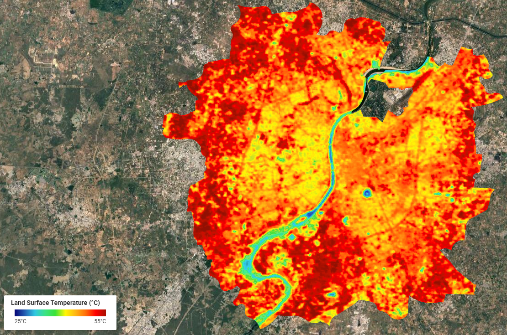
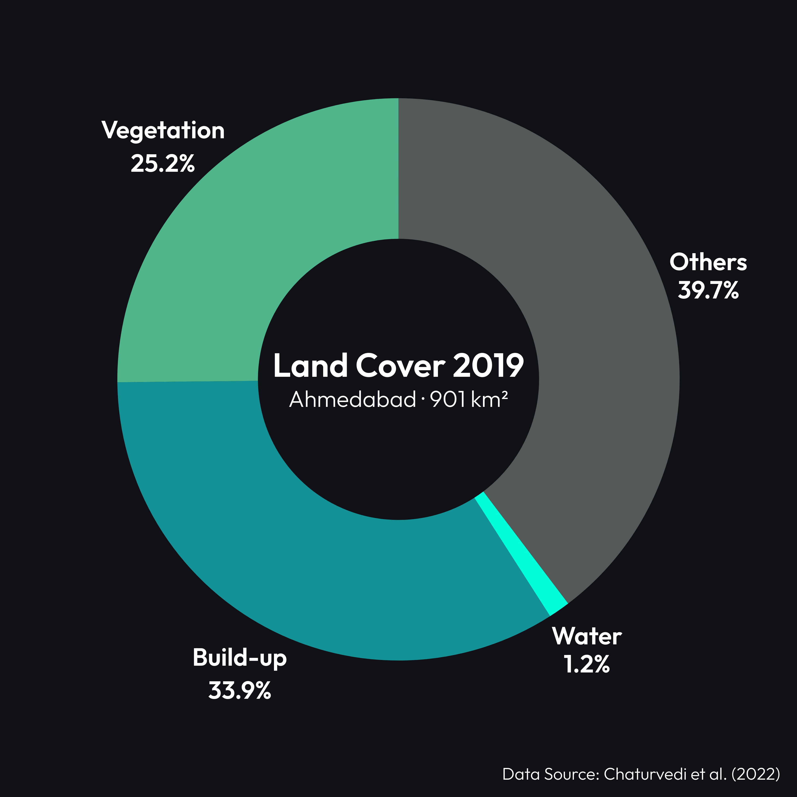
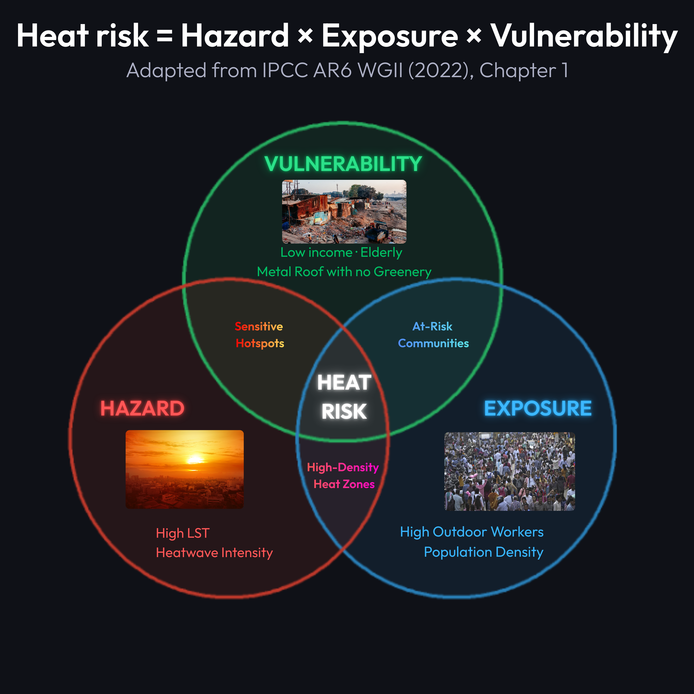

class: title-slide

<div style="position:absolute; top:8%; left:0; right:0; padding:2.3rem 4rem; border-top:1px solid rgba(201,169,110,0.5);">
<br>
<br>
<br>
<br>
<br>
<br>
<span style="display:inline-block; background:var(--bg-card); border:1px solid rgba(201,169,110,0.5); color:var(--gold); font-family:var(--font-body); font-size:0.7em; font-weight:500; letter-spacing:0.15em; text-transform:uppercase; padding:0.35em 0.9em; border-radius:2px; margin-bottom:1.2rem;">CASA0023 · Remotely Sensing Cities and Environments · 2026</span>

<h1 style="font-family:var(--font-display); font-size:3.4em; font-weight:700; color:var(--text-primary); line-height:1.05; margin:0 0 0.3em 0;">PROJECT THERMIS
<h2 style="font-family:var(--font-body); font-size:1.05em; font-weight:300; color:var(--text-secondary); letter-spacing:0.03em; margin:0 0 1.5rem 0;">Thermal Heat-Risk Earth Mapping & Intervention System</h2>

<p style="font-family:var(--font-body); font-size:0.8em; font-weight:300; color:var(--text-muted); letter-spacing:0.08em; text-transform:uppercase; margin:0.2em 0;">Bidding to Ahmedabad Municipal Corporation (AMC)</p>
<p style="font-family:var(--font-body); font-size:0.8em; font-weight:300; color:var(--white); letter-spacing:0.08em; text-transform:uppercase; margin:0.2em 0;">Terravance Advisory Group [TAG] · UCL CASA</p>
<p style="font-family:var(--font-body); font-size:0.8em; font-weight:300; color:var(--white); letter-spacing:0.08em; text-transform:uppercase; margin:0.2em 0;">March 2026</p>

</div>
```{r setup, include=FALSE}
options(htmltools.dir.version = FALSE)
knitr::opts_chunk$set(
  echo = FALSE, message = FALSE, warning = FALSE,
  fig.retina = 3, fig.align = "center"
)
```

```{r libraries, include=FALSE}
# install.packages(c("ggplot2","sf","tmap","rnaturalearth",
#                    "rnaturalearthdata","ggforce","showtext",
#                    "DiagrammeR","scales"))
library(ggplot2)
library(scales)
library(showtext)
font_add_google("Cormorant Garamond", "cormorant")   # ← 修正拼写
font_add_google("Outfit", "outfit")
showtext_auto()

# Shared ggplot theme for all figures
theme_eoheat <- function(base_size = 12) {
  theme_minimal(base_family = "outfit", base_size = base_size) +
  theme(
    plot.background  = element_rect(fill = "#0F1117", color = NA),
    panel.background = element_rect(fill = "#0F1117", color = NA),
    panel.grid.major = element_line(color = "#252A40", linewidth = 0.4),
    panel.grid.minor = element_blank(),
    text             = element_text(color = "#9DA3B4"),
    axis.text        = element_text(color = "#5C6380", size = rel(0.82)),
    axis.title       = element_text(color = "#9DA3B4", size = rel(0.9)),
    plot.title       = element_text(color = "#EDE8DF", face = "bold",
                                    size = rel(1.15), margin = margin(b = 6)),
    plot.subtitle    = element_text(color = "#9DA3B4", size = rel(0.85),
                                    margin = margin(b = 12)),
    plot.caption     = element_text(color = "#5C6380", size = rel(0.7),
                                    hjust = 0, margin = margin(t = 8)),
    legend.background = element_rect(fill = "#0F1117", color = NA),
    legend.text      = element_text(color = "#9DA3B4"),
    legend.title     = element_text(color = "#EDE8DF"),
    plot.margin      = margin(12, 12, 12, 12)
  )
}
```

---

## Presentation Structure

<br>

.pull-left[

.stat-box[
<span class="stat-number">01</span>
<span class="stat-label">Problem Definition</span>
<span class="stat-source">Slides 2–4 · ~2.5 min </span>
]

.stat-box.teal[
<span class="stat-number">02</span>
<span class="stat-label">Approach & Methodology</span>
<span class="stat-source">Slides 5–10 · ~4 min </span>
]

.stat-box[
<span class="stat-number">03</span>
<span class="stat-label">Project Plan & VFM</span>
<span class="stat-source">Slides 11–14 · ~2.5 min </span>
]

]

.pull-right[

<br>

> Our proposal is structured around a single question:
>
> **How do we get the right intervention to the right ward, on the right day — before people die?**

<br>

.text-small.text-muted[
All figures in this presentation are produced from open-access  
Earth Observation data (Landsat 8/9, Sentinel-2, MODIS) unless  
otherwise noted. Code available at: `https://github.com/ArthurZhang69/CASA0023-GROUP-PRESENTATION.git`
]

]

---
class: section-slide

<span class="section-number">01 · Problem Definition</span>
# The Problem

---

<!--
╔══════════════════════════════════════════════════════╗
║  SLIDE 02 · The Problem: Extreme Urban Heat Kills    ║
║  布局A：左栏上下叠两图，右栏统计数字                 ║
╚══════════════════════════════════════════════════════╝
-->

## The Problem: Extreme Urban Heat Kills

.slide-label[Slide 02 · Problem Definition]

.left-wide[

<div style="display:flex; gap:0.8rem; align-items:flex-start; margin-bottom:0.3rem;">

<div style="flex:1.5;">
```{r fig-lst-syz, out.width="100%", fig.align="left"}

```
</div>

<div style="flex:1;">
```{r fig-pie-hyj, out.width="100%", fig.align="center"}

```
</div>

</div>

```{r fig-a-syz, fig.height=2.8, fig.width=9.8, dev.args=list(bg="#0F1117")}
# ══════════════════════════════════════════════
# 📊 下图：人口与建成区折线图
# 数据来源：
#   Built-up area — Chaturvedi et al. (2022) Table 4
#   Population — Census of India (2001,2011); World Population Review
# ══════════════════════════════════════════════
df <- data.frame(
  year       = c(1990, 2000,  2001,  2010,  2011,  2019),
  population = c(3.547,4.519, 4.519, 5.578, 5.578, 7.868),
  builtup    = c(132.45,181.55,NA,  276.46, NA,   305.24)
)
df_builtup <- df[!is.na(df$builtup), ]
coeff <- 40

ggplot(df, aes(x = year)) +
  geom_area(data = df_builtup,
            aes(y = builtup / coeff), fill = "#C9A96E", alpha = 0.12) +
  geom_line(data = df_builtup,
            aes(y = builtup / coeff, color = "Built-up Area (km²)"),
            linewidth = 1.1, linetype = "dashed") +
  geom_point(data = df_builtup,
             aes(y = builtup / coeff, color = "Built-up Area (km²)"),
             size = 2.5, shape = 15) +
  geom_line(aes(y = population, color = "Population (millions)"),
            linewidth = 1.3) +
  geom_point(aes(y = population, color = "Population (millions)"),
             size = 2.8, shape = 19) +
  annotate("segment",
           x = 2010, xend = 2010, y = 0.3, yend = 9.4,
           color = "#E05C5C",alpha = 0.72,linewidth = 1) +
  annotate("label", x = 2010.4, y = 2.6,
           label = "May 2010\n1,344 deaths",
           fill = "#1E2235", color = "#E05C5C",
           size = 10.5, fontface = "bold", family = "outfit",
           label.padding = unit(0.2, "lines"),
           lineheight = 0.6, 
           label.r = unit(0.15, "lines"), hjust = 0) +
  scale_y_continuous(
    name = "Population (millions)", limits = c(0, 9.5),
    sec.axis = sec_axis(~ . * coeff, name = "Built-up Area (km²)")
  ) +
  scale_x_continuous(breaks = c(1990, 2000, 2010, 2019)) +
  scale_color_manual(values = c("Population (millions)" = "#EDE8DF",
                                "Built-up Area (km²)"   = "#C9A96E")) +
  labs(title   = "Rapid urbanisation drives escalating heat risk",
       caption = "Built-up: Chaturvedi et al. (2022) Table 4 · Population: Census of India / World Pop Review",
       x = NULL, color = NULL) +
  theme_eoheat(base_size = 10) +
  theme(legend.position    = c(0.18, 0.82),
      legend.text        = element_text(size = 26),
      legend.key.size    = unit(0.4, "cm"),
      axis.text          = element_text(size = 27, color = "#9DA3B4"),  # ← 轴刻度
      axis.title         = element_text(size = 27, color = "#9DA3B4"),  # ← 轴标题
      axis.title.y.right = element_text(size = 27, color = "#C9A96E"),
      axis.title.y.left  = element_text(size = 27, color = "#EDE8DF"),
      plot.title         = element_text(size = 29),
      plot.caption       = element_text(size = 26),
      plot.margin        = margin(4, 8, 4, 8))
```

<div style="text-align:left;">
.fig-caption[Top Left: LST map · Landsat 8 TIRS via GEE &nbsp;·&nbsp; Top Right: Land Cover 2019 · Chaturvedi et al. (2022)  
Bottom: Built-up & population · Chaturvedi et al. (2022)]
</div>

]

<div class="right-narrow" style="margin-top:-2.5rem;">

.stat-box.alert[
<span class="stat-number">1,344</span>
<span class="stat-label">Excess deaths, May 2010</span>
<span class="stat-source">Azhar et al. (2014), PLOS ONE</span>
]

.stat-box[
<span class="stat-number">46.8°C</span>
<span class="stat-label">Peak temperature, May 25</span>
<span class="stat-source">IMD / Azhar et al. (2014)</span>
]

.stat-box[
<span class="stat-number">+130%</span>
<span class="stat-label">Built-up area growth, 1990–2019</span>
<span class="stat-source">Chaturvedi et al. (2022) Table 4</span>
]

.stat-box.teal[
<span class="stat-number">70%</span>
<span class="stat-label">of city area projected ≥45°C</span>
<span class="stat-source">Mohammad et al. (2022)</span>
]

</div>

---

## Who Suffers Most? Heat Vulnerability is Unequal

.slide-label[Slide 03 · Problem Definition]

.pull-left[
<div style="margin-top:-1.4rem;">
```{r fig-c, out.width="100%", fig.align="left"}

```
</div>

.fig-caption[Fig. C · IPCC AR6 Risk Framework adapted for Ahmedabad]

]

.pull-right[

### Most exposed groups


| Group | Mechanism |
|-------|-----------|
| 🏚️ Slum communities | Metal roofs, no shade, no greenery |
| <span style="color:#EDE8DF">👷 Outdoor workers</span> | <span style="color:#9DA3B4">Direct thermal exposure, 8h+/day</span> |
| 👴 Elderly & infants | Impaired thermoregulation |
| <span style="color:#EDE8DF">💰 Low-income</span> | <span style="color:#9DA3B4">No AC, no access to cooling centres</span> |

<br>

> "The official temperature is recorded **8 km outside** the city. On the tarmac where workers walk, it can be **10°C hotter**."
>
> — Dr. Mavalankar, *Exemplars in Global Health* (2022)

.chip.alert[Spatial Data Gap] .chip[Ward-level] .chip.teal[1 Weather Station]

]

.footnote[IPCC AR6 WGII (2022) Ch.8 · Knowlton et al. (2014) *IJERPH* 11(4):3473 · Exemplars in Global Health (2022)]

---

## Policy Context: From Global Goals to Local Action

.slide-label[Slide 04 · Problem Definition]

.left-narrow[
<div style="height:1.5rem;"></div>

.policy-global[
<p style="font-family:var(--font-body); font-size:0.85em; font-weight:500; letter-spacing:0.18em; text-transform:uppercase; color:var(--teal); margin:0.6 0 0.6rem 0;">🌍 Global</p>
<div style="display:flex; justify-content:space-between; align-items:flex-start; gap:0.5rem;">
<div style="font-size:0.95em; line-height:1.8;font-family:var(--font-body);">
<strong>SDG</strong> 3.9 · 11.5 · 11.7 · 13.1<br>
<strong>Sendai Framework</strong> Priority 1 &amp; 3<br>
<strong>New Urban Agenda</strong> Para 37, 65, 79<br>&nbsp;
</div>

</div>
]

<span style="font-size:1.2em; color:#5C6380;"></span>

.policy-national[
<p style="font-family:var(--font-body); font-size:0.85em; font-weight:500; letter-spacing:0.18em; text-transform:uppercase; color:var(--gold); margin:0.6 0 0.6rem 0;">🕌 Regional</p>

<div style="display:flex; justify-content:space-between; align-items:flex-start; gap:0.5rem;">
<div style="font-size:0.98em; line-height:1.8;font-family:var(--font-body);">
<strong>NAPCC</strong> — Mission on Sustainable Habitat<br>
<strong>India NDC 2022</strong> — 33% urban green cover<br>&nbsp;
</div>

</div>
]

<span style="font-size:1.2em; color:#5C6380;"> </span>

.policy-local[
<p style="font-family:var(--font-body); font-size:0.85em; font-weight:500; letter-spacing:0.18em; text-transform:uppercase; color:var(--white); margin:0.6 0 0.6rem 0;">🌇 Local</p>
<div style="display:flex; justify-content:space-between; align-items:flex-start; gap:0.5rem;">
<div style="font-size:0.95em; line-height:1.8;font-family:var(--font-body);">
<strong>Ahmedabad HAP 2019</strong><br>
~1,190 deaths averted / year<br>&nbsp;
</div>

</div>
]

]

.right-wide[
<div style="height:1.4rem;"></div>

### Ahmedabad Heat Action Plan (2019) — 4 Pillars

.stat-box[
<span class="stat-label">① Public Awareness & Community Outreach</span>
Multilingual pamphlets, WhatsApp alerts, LED boards, school campaigns
]

.stat-box[
<span class="stat-label">② Early Warning System</span>
Colour-coded heat alerts (Green → Red) triggered by IMD temperature thresholds
]

.stat-box[
<span class="stat-label">③ Medical Preparedness</span>
Heat stroke wards, ORS corners in all AMC hospitals, frontline worker training
]

.stat-box[
<span class="stat-label">④ Reduce Heat Exposure (Long-term)</span>
Cool Roofs Programme, 24hr park access, cooling centres for slum communities
]


<div style="background:var(--bg-card); border-left:3px solid var(--teal); padding:2.98rem 1.2rem; width:100%; box-sizing:border-box; font-style:italic; color:var(--white); font-size:0.9em;font-weight:600;">
The HAP is pioneering — but all 4 pillars activate from <strong style="color:var(--teal);">one weather station</strong>. THERMIS provides the <strong style="color:var(--teal);">ward-level spatial data</strong> that makes every pillar more targeted.
</div>

]

.footnote[AMC / NRDC / IIPH-G (2019) *Ahmedabad HAP 2019* · Hess et al. (2018) *J Environ Public Health* · UNDRR (2015) Sendai Framework · UN (2017) New Urban Agenda]

---
class: section-slide

<span class="section-number">02 · Approach & Methodology</span>
# Our Approach

---

## Earth Observation & Ancillary Data

.slide-label[Slide 06 · Approach]

```{r fig-f, fig.height=3.8, fig.width=11}
datasets <- data.frame(
  name   = c("Landsat 8/9 TIRS", "Sentinel-2 MSI", "MODIS MOD11A2",
              "Census Ward Data", "OSM Buildings"),
  start  = c(1984, 2015, 2000, 2001, 2010),
  end    = c(2026, 2026, 2026, 2011, 2026),
  res    = c("30 m · 16-day", "10 m · 5-day", "1 km · 8-day",
             "Ward-level", "Building-level"),
  use    = c("Land Surface Temperature (LST)",
             "NDVI · Land Cover Classification",
             "Long-term LST trend (2000–2025)",
             "Demographics · Vulnerability Index",
             "Urban morphology · Imperviousness"),
  colour = c("#C9A96E", "#4FC4CF", "#E05C5C", "#58D68D", "#9DA3B4")
)

y_pos <- c(4, 3, 2, 1, 0)

ggplot(datasets) +
  geom_segment(aes(x = start, xend = end,
                   y = y_pos, yend = y_pos,
                   color = colour),
               linewidth = 5.5, lineend = "round") +
  geom_label(aes(x = start + 0.5, y = y_pos,
                 label = name, color = colour),
             fill = "#0F1117", size = 3.1,
             family = "outfit", fontface = "bold",
             label.padding = unit(0.3, "lines"),
             label.r = unit(0.15, "lines"), hjust = 0) +
  geom_text(aes(x = end - 0.5, y = y_pos + 0.55,
                label = res, color = colour),
            size = 2.5, family = "outfit", hjust = 1) +
  geom_text(aes(x = (start + end) / 2, y = y_pos - 0.45,
                label = use),
            color = "#5C6380", size = 2.6, family = "outfit") +
  scale_color_identity() +
  scale_x_continuous(breaks = seq(1985, 2025, 5),
                     expand = expansion(add = c(1, 2))) +
  labs(
    title    = "Multi-sensor, multi-temporal Earth Observation stack",
    subtitle = "All datasets free & analysis-ready via Google Earth Engine",
    x = NULL, y = NULL
  ) +
  theme_eoheat() +
  theme(axis.text.y = element_blank(),
        panel.grid.major.y = element_blank())
```

.fig-caption[Fig. F · EO Data Timeline · USGS / ESA / NASA / Census India / OpenStreetMap]

.footnote[All EO data accessed via Google Earth Engine · No licensing cost · Full temporal coverage from 1984]

---
class: section-slide

<span class="section-number">03 · Project Plan</span>
# Project Plan &amp; Value for Money


---
## Project Timeline

.slide-label[Slide 13a · Project Plan]

.left-wide[

```{r gantt-chart, fig.height=7.6, fig.width=14, out.width="100%",dev.args=list(bg="#0F1117")}
lvls <- rev(c("WP0  Stakeholder Scoping & Data Audit",
              "WP1  LST Mapping (Landsat 8/9 TIRS)",
              "WP2  Land Cover & Green Space (Sentinel-2)",
              "WP3  Heat Vulnerability Index",
              "WP4  Dashboard & Deliverables",
              "WP5  Training, Handover & BAU"))

wp <- data.frame(
  label = factor(c("WP0  Stakeholder Scoping & Data Audit",
                    "WP1  LST Mapping (Landsat 8/9 TIRS)",
                    "WP2  Land Cover & Green Space (Sentinel-2)",
                    "WP3  Heat Vulnerability Index",
                    "WP4  Dashboard & Deliverables",
                    "WP5  Training, Handover & BAU"), levels = lvls),
  start = c(1, 2, 3, 5, 7, 9),
  end   = c(2, 5, 6, 8, 10, 12),
  col   = c("#5C6380", "#C9A96E", "#4FC4CF",
            "#58D68D", "#E05C5C", "#9B59B6")
)

# Milestones mapped to the same factor levels
ms <- data.frame(
  month = c(2, 5,6, 8, 10, 12),
  wp    = factor(c("WP0  Stakeholder Scoping & Data Audit",
                   "WP1  LST Mapping (Landsat 8/9 TIRS)",
                    "WP2  Land Cover & Green Space (Sentinel-2)",
                    "WP3  Heat Vulnerability Index",
                    "WP4  Dashboard & Deliverables",
                    "WP5  Training, Handover & BAU"), levels = lvls),
  tag   = c("Data Audit\nComplete",
            "LST Map\nDelivered",
            "LST & LULC\nDelivered",
            "HVI Map\nDelivered",
            "Dashboard\nBeta",
            "Final\nHandover")
)

ggplot(wp, aes(y = label)) +
  # Bars
  geom_segment(aes(x = start - 0.1, xend = end + 0.1,
                   yend = label, colour = col),
               linewidth = 7, lineend = "round") +
  # Milestones
  geom_point(data = ms, aes(x = month, y = wp),
             shape = 18, size = 5.5, colour = "#EDE8DF",
             inherit.aes = FALSE) +
  geom_text(data = ms,
            aes(x = month + 0.35, y = wp, label = tag),
            colour = "#EDE8DF", size = 11.8, family = "outfit",
            fontface = "bold", lineheight = 0.55,
            hjust = 0, vjust = 0.5,
            inherit.aes = FALSE) +
  scale_colour_identity() +
  scale_x_continuous(
    breaks = 1:12, labels = paste0("M", 1:12),
    limits = c(0.5, 14.5), expand = expansion(add = 0)
  ) +
  labs(title = "12-month delivery schedule",
       subtitle = "6 work packages \u00b7 5 key milestones \u00b7 phased around pre-monsoon window (Mar\u2013May)",
       x = NULL, y = NULL) +
  theme_eoheat(base_size = 13) +
  theme(
    panel.grid.major.y = element_blank(),
    axis.text.y  = element_text(size = 30, colour = "white", hjust = 1, face = "bold"),
    axis.text.x  = element_text(size = 30, colour = "white", face = "bold"),
    plot.title    = element_text(size = 63),
    plot.subtitle = element_text(size = 30.5)
  )
```

.fig-caption[Fig. P · Gantt chart — WP0 to WP5 with milestone diamonds]

]

.right-narrow[

<h3 style="font-family:var(--font-body); font-size:1.2em; font-weight:500; color:var(--gold); text-transform:uppercase; letter-spacing:0.12em; margin-top:0; margin-top:-2rem;margin-bottom:0.6rem;">Why this timeline?</h3>

<div style="font-size:0.98em; line-height:1.55; color:var(--text-secondary);">

<p style="margin:0 0 0.55rem 0;"><strong style="color:#EDE8DF;">Pre-monsoon window (Mar–May)</strong><br>Peak heat + cloud cover &lt;15% maximises usable Landsat &amp; Sentinel scenes over Gujarat<br><span style="color:#5C6380; font-size:0.9em;">(Rajeshwari &amp; Mani, 2014)</span></p>

<p style="margin:0 0 0.55rem 0;"><strong style="color:#EDE8DF;">WP0 scoping before analysis</strong><br>UNDP guidance mandates stakeholder mapping &amp; data audit before technical work to prevent scope creep<br><span style="color:#5C6380; font-size:0.9em;">(UNDP, 2021)</span></p>

<p style="margin:0 0 0.55rem 0;"><strong style="color:#EDE8DF;">WP5 overlaps WP4 by 2 months</strong><br>Iterative training alongside dashboard development — World Bank "learning-by-doing" model<br><span style="color:#5C6380; font-size:0.9em;">(World Bank, 2019)</span></p>

<p style="margin:0;"><strong style="color:#EDE8DF;">12 months total</strong><br>Consistent with UNEP/GRID urban heat programme: 10–14 months for city-scale delivery<br><span style="color:#5C6380; font-size:0.9em;">(UNEP, 2023)</span></p>

</div>

]

.footnote[Rajeshwari & Mani (2014) *Int. J. Appl. Eng. Res.* · UNDP (2021) *Project Management Guidance* · World Bank (2019) *Capacity Building Framework* · UNEP (2023) *Beating the Heat* report]

---

## Budget & Value for Money

.slide-label[Slide 13b · Project Plan]

.left-wide[
<br>
<br>
```{r budget-bar, fig.height=5.5, fig.width=12, out.width="100%",dev.args=list(bg="#0F1117")}
library(ggtext)

budget <- data.frame(
  item   = c("**Personnel**<br><span style='font-size:25pt;color:#9DA3B4'>(2 RS analysts + 1 GIS engineer + 1 PM)</span>",
             "**Local Partner**<br><span style='font-size:25pt;color:#9DA3B4'>(AMC liaison & field coordination)</span>",
             "**Stakeholder Engagement**<br><span style='font-size:25pt;color:#9DA3B4'>(workshops, ward councillor meetings)</span>",
             "**Capacity Building & Training**<br><span style='font-size:25pt;color:#9DA3B4'>(AMC staff upskilling, SOP manuals)</span>",
             "**Software & Cloud Compute**<br><span style='font-size:25pt;color:#9DA3B4'>(GEE, QGIS, server hosting)</span>",
             "**Reporting & Dissemination**<br><span style='font-size:25pt;color:#9DA3B4'>(publications, policy briefs)</span>",
             "**Contingency Reserve**<br><span style='font-size:25pt;color:#9DA3B4'>(ring-fenced for overruns)</span>"),
  amount = c(280, 50, 45, 30, 20, 15, 60),
  fill   = c("#C9A96E", "#4FC4CF", "#58D68D",
             "#9B59B6", "#5DADE2", "#F0A04B", "#5C6380")
)
budget$item <- factor(budget$item, levels = rev(budget$item))
budget$lab  <- paste0("\u00a3", budget$amount, "k")
budget$pct  <- paste0(round(budget$amount / 500 * 100), "%")

ggplot(budget, aes(x = amount, y = item, fill = fill)) +
  geom_col(width = 0.55) +
  geom_text(aes(label = lab),
            hjust = -0.12, colour = "#EDE8DF",
            size = 15.8, family = "outfit", fontface = "bold") +
  geom_text(aes(label = pct, x = amount - 3),
            hjust = 1, colour = "#0F1117",
            size = 13.0, family = "outfit", fontface = "bold") +
  scale_fill_identity() +
  scale_x_continuous(expand = expansion(mult = c(0, 0.18))) +
  labs(title    = "Budget allocation \u00b7 \u00a3500,000",
       subtitle = "Personnel-led investment typical of technical consultancy; zero EO data licence cost",
       x = NULL, y = NULL) +
  theme_eoheat(base_size = 12) +
  theme(
    panel.grid.major.y = element_blank(),
    panel.grid.major.x = element_blank(),
    axis.text.y  = element_markdown(size = 30, colour = "white", hjust = 1,
                                    lineheight = 0.4, vjust = 0.5),
    axis.text.x  = element_blank(),
    axis.line.x = element_blank(),
    axis.ticks.x = element_blank(),
    plot.title    = element_text(size = 53),
    plot.subtitle = element_text(size = 29.5)
  )
```

.fig-caption[Fig. Q · Budget breakdown by category with percentage labels]

]

.right-narrow[

<h3 style="font-family:var(--font-body); font-size:1.2em; font-weight:500; color:var(--gold); text-transform:uppercase; letter-spacing:0.12em; margin-top:0;margin-top:-2rem; margin-bottom:0.6rem;">Why this budget?</h3>

<div style="font-size:0.98em; line-height:1.55; color:var(--text-secondary);">

<p style="margin:0 0 0.55rem 0;"><strong style="color:#EDE8DF;">Personnel 56%</strong><br>Consistent with UKRI-funded technical consultancy where specialist staff are the primary cost driver<br><span style="color:#5C6380; font-size:0.9em;">(UKRI, 2022)</span></p>

<p style="margin:0 0 0.55rem 0;"><strong style="color:#EDE8DF;">12% contingency</strong><br>Follows FCDO (formerly DFID) best practice of 10–15% for international development projects<br><span style="color:#5C6380; font-size:0.9em;">(FCDO, 2020)</span></p>

<p style="margin:0 0 0.55rem 0;"><strong style="color:#EDE8DF;">£0 EO data cost</strong><br>All Landsat, Sentinel-2 &amp; MODIS data are open-access via Google Earth Engine — no licensing fee<br><span style="color:#5C6380; font-size:0.9em;">(Gorelick et al., 2017)</span></p>

<p style="margin:0;"><strong style="color:#EDE8DF;">Local partner £50k</strong><br>Embeds AMC liaison from day one, aligning outputs with the Heat Action Plan revision cycle<br><span style="color:#5C6380; font-size:0.9em;">(AMC, 2019)</span></p>

</div>

.chip[56% Personnel] .chip.teal[12% Contingency] .chip[0% EO Licence]

]

.footnote[UKRI (2022) *Full Economic Costing Guide* · FCDO (2020) *Smart Rules* · Gorelick et al. (2017) *Remote Sens. Environ.* 202:18–27 · AMC/NRDC (2019) *Ahmedabad Heat Action Plan*]

---

## Risk Register

.slide-label[Slide 14 · Project Plan]

<table style="width:100%; border-collapse:collapse; font-size:0.82em; margin-top:0.2rem; line-height:1.45;">
<thead>
<tr style="background:#252A40; border-bottom:2px solid rgba(201,169,110,0.4);">
  <th style="padding:0.4rem 0.6rem; color:#C9A96E; font-size:0.78em; letter-spacing:0.08em; text-transform:uppercase; text-align:left; width:3%;">#</th>
  <th style="padding:0.4rem 0.6rem; color:#C9A96E; font-size:0.78em; letter-spacing:0.08em; text-transform:uppercase; text-align:left; width:27%;">Risk Description</th>
  <th style="padding:0.4rem 0.6rem; color:#C9A96E; font-size:0.78em; letter-spacing:0.08em; text-transform:uppercase; text-align:center; width:7%;">Likelihood</th>
  <th style="padding:0.4rem 0.6rem; color:#C9A96E; font-size:0.78em; letter-spacing:0.08em; text-transform:uppercase; text-align:center; width:7%;">Impact</th>
  <th style="padding:0.4rem 0.6rem; color:#C9A96E; font-size:0.78em; letter-spacing:0.08em; text-transform:uppercase; text-align:left; width:56%;">Mitigation Strategy</th>
</tr>
</thead>
<tbody>
<tr style="background:rgba(224,92,92,0.06); border-bottom:1px solid rgba(201,169,110,0.12);">
  <td style="padding:0.35rem 0.6rem; color:#C9A96E; font-weight:600;">R1</td>
  <td style="padding:0.35rem 0.6rem; color:#EDE8DF;">Cloud cover limits usable Landsat&nbsp;8/9 and Sentinel&#8209;2 scenes for LST and land&#8209;cover analysis</td>
  <td style="padding:0.35rem 0.6rem; text-align:center;"><span style="background:#F0A04B; color:#0F1117; padding:0.15em 0.5em; border-radius:3px; font-weight:600; font-size:0.85em;">Med</span></td>
  <td style="padding:0.35rem 0.6rem; text-align:center;"><span style="background:#E05C5C; color:#0F1117; padding:0.15em 0.5em; border-radius:3px; font-weight:600; font-size:0.85em;">High</span></td>
  <td style="padding:0.35rem 0.6rem; color:#9DA3B4;">Acquire in pre&#8209;monsoon dry window (Mar&ndash;May, &lt;15% cloud); gap&#8209;fill with MODIS 8&#8209;day composites</td>
</tr>
<tr style="background:rgba(79,196,207,0.04); border-bottom:1px solid rgba(201,169,110,0.12);">
  <td style="padding:0.35rem 0.6rem; color:#C9A96E; font-weight:600;">R2</td>
  <td style="padding:0.35rem 0.6rem; color:#EDE8DF;">Ward boundaries redrawn between India Census cycles, causing spatial mismatch with demographic data</td>
  <td style="padding:0.35rem 0.6rem; text-align:center;"><span style="background:#58D68D; color:#0F1117; padding:0.15em 0.5em; border-radius:3px; font-weight:600; font-size:0.85em;">Low</span></td>
  <td style="padding:0.35rem 0.6rem; text-align:center;"><span style="background:#F0A04B; color:#0F1117; padding:0.15em 0.5em; border-radius:3px; font-weight:600; font-size:0.85em;">Med</span></td>
  <td style="padding:0.35rem 0.6rem; color:#9DA3B4;">Use Ahmedabad Municipal Corporation (AMC) latest shapefile; automated spatial harmonisation in GEE</td>
</tr>
<tr style="background:rgba(224,92,92,0.06); border-bottom:1px solid rgba(201,169,110,0.12);">
  <td style="padding:0.35rem 0.6rem; color:#C9A96E; font-weight:600;">R3</td>
  <td style="padding:0.35rem 0.6rem; color:#EDE8DF;">Staff turnover at AMC disrupts adoption of routine annual monitoring (business&#8209;as&#8209;usual) after handover</td>
  <td style="padding:0.35rem 0.6rem; text-align:center;"><span style="background:#F0A04B; color:#0F1117; padding:0.15em 0.5em; border-radius:3px; font-weight:600; font-size:0.85em;">Med</span></td>
  <td style="padding:0.35rem 0.6rem; text-align:center;"><span style="background:#E05C5C; color:#0F1117; padding:0.15em 0.5em; border-radius:3px; font-weight:600; font-size:0.85em;">High</span></td>
  <td style="padding:0.35rem 0.6rem; color:#9DA3B4;">Train 5+ staff across 2 AMC departments; deliver Standard Operating Procedure manuals &amp; video tutorials</td>
</tr>
<tr style="background:rgba(79,196,207,0.04); border-bottom:1px solid rgba(201,169,110,0.12);">
  <td style="padding:0.35rem 0.6rem; color:#C9A96E; font-weight:600;">R4</td>
  <td style="padding:0.35rem 0.6rem; color:#EDE8DF;">Personnel costs exceed budget due to extended specialist engagement or currency fluctuation</td>
  <td style="padding:0.35rem 0.6rem; text-align:center;"><span style="background:#58D68D; color:#0F1117; padding:0.15em 0.5em; border-radius:3px; font-weight:600; font-size:0.85em;">Low</span></td>
  <td style="padding:0.35rem 0.6rem; text-align:center;"><span style="background:#E05C5C; color:#0F1117; padding:0.15em 0.5em; border-radius:3px; font-weight:600; font-size:0.85em;">High</span></td>
  <td style="padding:0.35rem 0.6rem; color:#9DA3B4;">Fixed&#8209;term contracts with capped day&#8209;rates; 12% contingency reserve (&pound;60k) ring&#8209;fenced for overruns</td>
</tr>
<tr style="background:rgba(224,92,92,0.06); border-bottom:1px solid rgba(201,169,110,0.12);">
  <td style="padding:0.35rem 0.6rem; color:#C9A96E; font-weight:600;">R5</td>
  <td style="padding:0.35rem 0.6rem; color:#EDE8DF;">Key stakeholders (AMC officials, ward councillors) disengage, delaying feedback on deliverables</td>
  <td style="padding:0.35rem 0.6rem; text-align:center;"><span style="background:#F0A04B; color:#0F1117; padding:0.15em 0.5em; border-radius:3px; font-weight:600; font-size:0.85em;">Med</span></td>
  <td style="padding:0.35rem 0.6rem; text-align:center;"><span style="background:#F0A04B; color:#0F1117; padding:0.15em 0.5em; border-radius:3px; font-weight:600; font-size:0.85em;">Med</span></td>
  <td style="padding:0.35rem 0.6rem; color:#9DA3B4;">Embed dedicated AMC liaison officer in team from Month&nbsp;1; quarterly review workshops</td>
</tr>
<tr style="background:rgba(79,196,207,0.04);">
  <td style="padding:0.35rem 0.6rem; color:#C9A96E; font-weight:600;">R6</td>
  <td style="padding:0.35rem 0.6rem; color:#EDE8DF;">Landsat thermal band (100&nbsp;m) yields insufficient accuracy when aggregated to ward&#8209;level for the Heat Vulnerability Index</td>
  <td style="padding:0.35rem 0.6rem; text-align:center;"><span style="background:#58D68D; color:#0F1117; padding:0.15em 0.5em; border-radius:3px; font-weight:600; font-size:0.85em;">Low</span></td>
  <td style="padding:0.35rem 0.6rem; text-align:center;"><span style="background:#F0A04B; color:#0F1117; padding:0.15em 0.5em; border-radius:3px; font-weight:600; font-size:0.85em;">Med</span></td>
  <td style="padding:0.35rem 0.6rem; color:#9DA3B4;">Cross&#8209;validate with MODIS MOD11A2 &amp; IMD ground stations; report RMSE per ward</td>
</tr>
</tbody>
</table>

<div style="margin-top:0.8rem;"></div>

.footnote[Risk colour key — <span style="background:#E05C5C; color:#0F1117; padding:0.15em 0.5em; border-radius:3px; font-size:0.9em; font-weight:600;">High</span>&ensp;<span style="background:#F0A04B; color:#0F1117; padding:0.15em 0.5em; border-radius:3px; font-size:0.9em; font-weight:600;">Medium</span>&ensp;<span style="background:#58D68D; color:#0F1117; padding:0.15em 0.5em; border-radius:3px; font-size:0.9em; font-weight:600;">Low</span> · 6 dimensions: data quality · administrative · institutional capacity · budget · stakeholder · technical accuracy]
---

## Summary: Why PROJECT THERMIS initiated in Ahmedabad?

.slide-label[Slide 15 · Summary & Call to Action]

<div style="display:flex; gap:1.4rem; margin:1rem 0 1.8rem 0;">

<div style="flex:1; background:#1E2235; border:1px solid rgba(201,169,110,0.25); border-top:3px solid #C9A96E; border-radius:0 0 4px 4px; padding:1.4rem 1.2rem; text-align:center;">
<div style="font-size:1.6em; margin-bottom:0.5rem;">&#x1F6F0;&#xFE0F;</div>
<div style="font-family:'Outfit',sans-serif; font-size:1.1em; font-weight:600; color:#EDE8DF; margin-bottom:0.4rem;">Evidence-Based</div>
<div style="font-size:0.85em; color:#9DA3B4; line-height:1.55;">Multi-sensor EO pipeline delivers <strong style="color:#C9A96E;">ward-level heat intelligence</strong> unavailable from ground stations alone</div>
</div>

<div style="flex:1; background:#1E2235; border:1px solid rgba(79,196,207,0.3); border-top:3px solid #4FC4CF; border-radius:0 0 4px 4px; padding:1.4rem 1.2rem; text-align:center;">
<div style="font-size:1.6em; margin-bottom:0.5rem;">&#x1F4CB;</div>
<div style="font-family:'Outfit',sans-serif; font-size:1.1em; font-weight:600; color:#EDE8DF; margin-bottom:0.4rem;">Policy-Ready</div>
<div style="font-size:0.85em; color:#9DA3B4; line-height:1.55;">Outputs map directly onto <strong style="color:#4FC4CF;">HAP's 4 pillars</strong> and SDG 11 / 13 reporting requirements</div>
</div>

<div style="flex:1; background:#1E2235; border:1px solid rgba(88,214,141,0.3); border-top:3px solid #58D68D; border-radius:0 0 4px 4px; padding:1.4rem 1.2rem; text-align:center;">
<div style="font-size:1.6em; margin-bottom:0.5rem;">&#x1F504;</div>
<div style="font-family:'Outfit',sans-serif; font-size:1.1em; font-weight:600; color:#EDE8DF; margin-bottom:0.4rem;">Sustainable</div>
<div style="font-size:0.85em; color:#9DA3B4; line-height:1.55;">GEE-based workflow enables AMC to <strong style="color:#58D68D;">self-update annually</strong> at near-zero marginal cost</div>
</div>

</div>

.pull-left[

> **In 2010, Ahmedabad lost 1,344 lives to a single heat wave. THERMIS ensures the city never faces that crisis blind again.**

.checklist[
- First **ward-level Heat Vulnerability Index** for Ahmedabad
- **Annual self-updating** GEE pipeline — no recurring licence cost
- Directly feeds **HAP annual revision** & SDG 11/13 national reporting
]

]

.pull-right[

.stats-row[

.stat-box.alert[
<span class="stat-number">1,344</span>
<span class="stat-label">Lives lost · May 2010</span>
<span class="stat-source">The crisis we address</span>
]

.stat-box.teal[
<span class="stat-number">£500k</span>
<span class="stat-label">Total investment</span>
<span class="stat-source">Self-sustaining after Year 1</span>
]

]

<br>

.mono.text-small.text-muted[
github.com/ArthurZhang69/CASA0023-GROUP-PRESENTATION
]

]

.footnote[Azhar et al. (2014) *PLOS ONE* · Hess et al. (2018) · AMC/NRDC (2019) HAP · CASA0023 · UCL 2026 · Xaringan + R + ggplot2 · All EO via GEE]
---
class: final-slide

<div style="display:flex; flex-direction:column; align-items:center; justify-content:center; height:100%; padding:3rem 4rem;">

<h1 style="font-family:var(--font-display); color:var(--text-primary); margin:0 0 0.2em 0;">Thank You</h1>
<p style="font-family:var(--font-body); color:var(--text-muted); letter-spacing:0.15em; text-transform:uppercase; font-size:0.8em; margin:0 0 2.5rem 0;">Questions Welcome</p>

<div style="display:flex; gap:1.5rem; width:100%; max-width:900px; margin-bottom:2rem;">

<div style="flex:1; background:var(--bg-card); border:1px solid var(--border); border-radius:4px; padding:1.2rem;">
<p style="font-family:var(--font-body); color:var(--gold); font-size:0.65em; letter-spacing:0.18em; text-transform:uppercase; margin:0 0 0.5rem 0;">Project Lead</p>
<p style="color:var(--text-primary); margin:0 0 0.3rem 0;">Arthur Zhang</p>
<p style="font-family:var(--font-mono); color:var(--text-muted); font-size:0.75em; margin:0;">arthur.zhang.22@ucl.ac.uk</p>
</div>

<div style="flex:1; background:var(--bg-card); border:1px solid var(--border); border-radius:4px; padding:1.2rem;">
<p style="font-family:var(--font-body); color:var(--gold); font-size:0.65em; letter-spacing:0.18em; text-transform:uppercase; margin:0 0 0.5rem 0;">EO Analysis</p>
<p style="color:var(--text-primary); margin:0 0 0.3rem 0;">Member B</p>
<p style="font-family:var(--font-mono); color:var(--text-muted); font-size:0.75em; margin:0;">b.member@ucl.ac.uk</p>
</div>

<div style="flex:1; background:var(--bg-card); border:1px solid var(--border); border-radius:4px; padding:1.2rem;">
<p style="font-family:var(--font-body); color:var(--teal); font-size:0.65em; letter-spacing:0.18em; text-transform:uppercase; margin:0 0 0.5rem 0;">Repository</p>
<p style="color:var(--text-primary); margin:0 0 0.3rem 0;">All code &amp; data</p>
<p style="font-family:var(--font-mono); color:var(--text-muted); font-size:0.75em; margin:0;">github.com/[team]/eo-heat</p>
</div>

</div>

<p style="font-family:var(--font-body); color:var(--text-muted); font-size:0.7em; text-align:center; margin:0;">CASA0023 · Remotely Sensing Cities and Environments · UCL 2026<br>Slides produced with Xaringan · R · ggplot2 · All EO data via Google Earth Engine</p>

</div>
